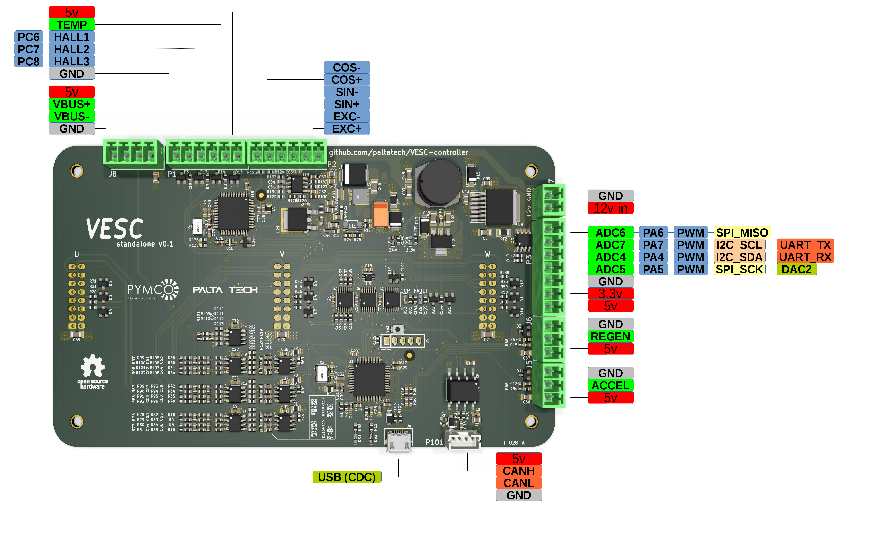
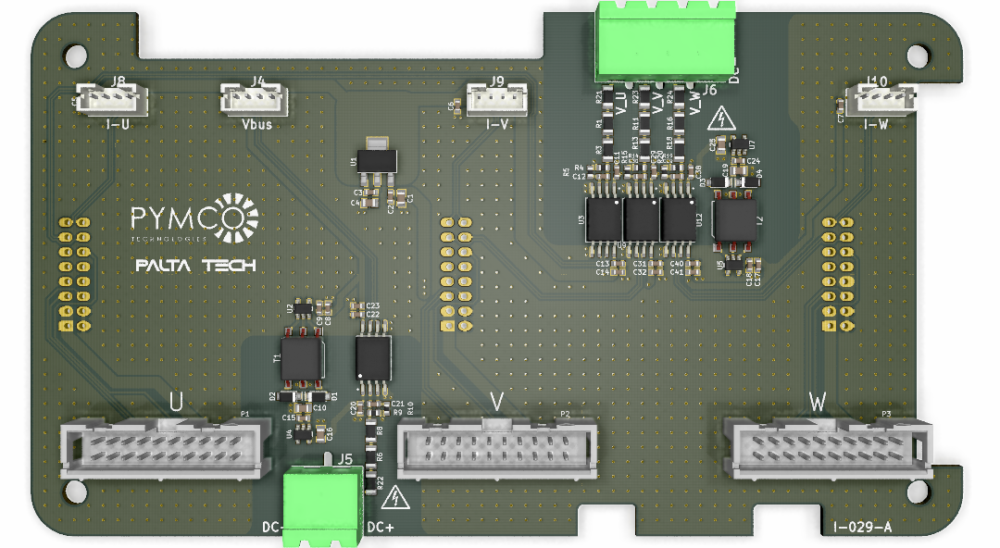

# 3 phase motor controller for high power systems
This is the hardware repository of a 3 phase inverter brain, UNTESTED but designed with the following specs in mind:

* Compatible with VESC firmware and software tools
* Embedded security features (overcurrent protection, pwm overlap elimination, etc)

## Microcontroller
The core of the system is a 32 bit ARM Cortex M4 MCU (STM32F405) running ChibiOS RTOS.

## Communication interfaces
* CAN bus for control, configuration and monitoring
* USB for light usage, firmware upload/upgrade and configuration.
* UART, I2C and ADCs and GPIOs available

## Motor inputs
* Bus Voltage (differential)
* Phase current (differential)
* Phase voltage (differential)
* Gate driver fault
* Power_good from gate driver
* Motor temperature
* Hall/encoder
* Resolver

## Gate driver outputs
* PWM high/low
* dynamic gate drive current (pwm)
* 24v power

You can also check the layout [here](https://eyrie.io/board/6f397be723754f039735d8350260c2c0) 

Made open source with KiCAD, an open source EDA tool.

## Interface boards
This controller can be interfaced directly to a power stage, or through an interface board.
An example of interface board is at adaptor boards/power_integrations_2SP0115T2A/ and looks like this

An example of system assembly is also included in this repository

## Control board setup

First you need to flash the VESC bootloader. To do so, connect a STLinkv2 to connector J9. In a Linux machine open a terminal and clone the bootloader repository:

1. `git clone git@github.com:vedderb/bldc-bootloader.git`
2. `cd bldc-bootloader`
3. `make upload`   <- this will compile and flash the bootloader

Next step is to flash the VESC firmware.

1. `git clone git@github.com:vedderb/bldc.git`
2. `Make sure you go to conf_general.h and uncomment the line #define HW_VERSION_PALTA. This will enable all the features especific to this high power control board.`
3. `Configure the DEADTIME required for your power switches, look for the line #define HW_DEAD_TIME_VALUE		181  // 1.4usec  in hw_palta.h`
4. `cd bldc`
5. `make upload`  <- this will compile and flash vesc firmware

Connect the board via USB (conn J4) and launch the latest [VESC-tool](http://vesc-project.com/vesc_tool).

1. Press the connect button (top right). The status bar should show your PALTA board connected.
2. Load a sample configuration for this board, you probably need to tune the deadtime compensation field.
3. Run the motor setup wizard.

## System setup

A high power controller would generally need a battery, wiring, contactor, DC link, gate drivers, switches, an interface board, 3 current sensors, a heatsink and a motor. Make sure you have everything you need and you understand all the connections and dangers involved, especially the safety related stuff.

## License
This documentation describes Open Hardware and is licensed under the CERN OHL v. 1.2

