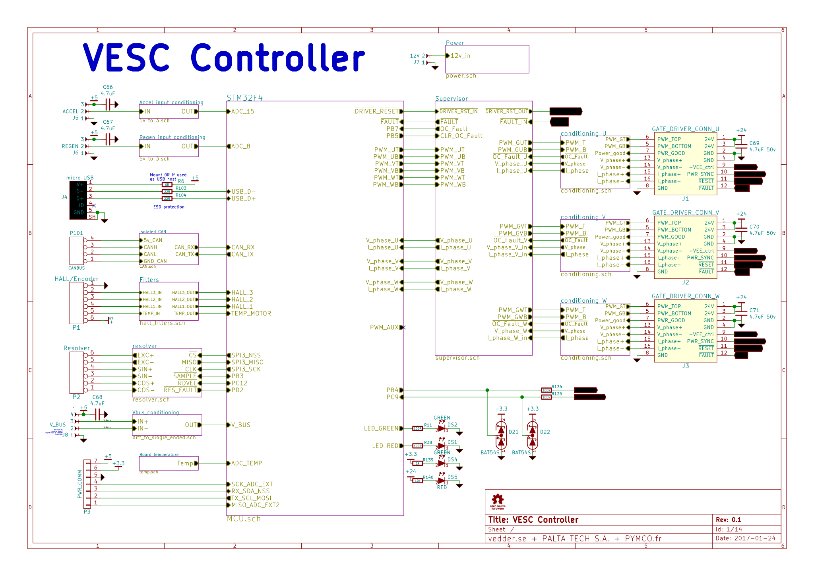

# VESC controller for high power systems
This is the hardware repository of a 3 phase inverter brain, UNTESTED but designed with the following specs in mind:

* Compatible with VESC firmware and software tools
* Embedded security features (overcurrent protection, pwm overlap elimination, etc)

## Microcontroller
The core of the system is a 32 bit ARM Cortex M4 MCU (STM32F405)

## Communication interfaces
* CAN bus for control, configuration and monitoring
* USB for light usage, firmware upload/upgrade and configuration.
* UART, I2C and ADCs and GPIOs available

## Motor inputs
* Bus Voltage (differential)
* Phase current (differential)
* Phase voltage (differential)
* Gate driver fault
* Power_good from gate driver
* Motor temperature
* Hall/encoder
* Resolver

## Gate driver outputs
* PWM high/low
* dynamic gate drive current (pwm)
* 24v power

You can also check the layout [here](https://eyrie.io/board/6f397be723754f039735d8350260c2c0) 

Made open source with KiCAD, an open source EDA tool.

## License
This documentation describes Open Hardware and is licensed under the CERN OHL v. 1.2

